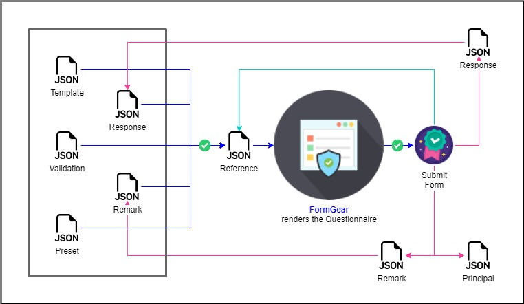

# Changelog

## FormGear | Ver. 0.1.4

> June 5, 2022

### Added
- Add summary to response
- Add click on label on SingleCheckInput and ToggleInput

### Changed
- Rename lastUpdated to updatedAt
- Disable ListTextInput and ListSelectInput button on formMode > 1


---


## FormGear | Ver. 0.1.3

> May 31, 2022

### Changed
- Update formMode: 
	- *1 => OPEN*
	
		This mode is used for data collection activities in general, and it allows users to modify all components of questions and remarks according to the template's constraints.

	- *2 => REVIEW*

		This mode is used to review the questionnaire post-data collection, and it only allows users to add remarks on each component based on the examination findings.

	- *3 => CLOSE* 

		This mode is used just to review the questionnaire upon post-data collection and examination findings.
- Update label view css on SelectInput inline with required and hint instruction.
- Set clickable label on nested input button to enter the nested section.
- Remove reformat answer onValueChange on MaskingInput.
- Update error list css on MaskingInput as other.
- Reactive changes in related components when dependent selectInput change.


### Added
- Trigger save (including response, principal, remark, and reference) on post remark.
- Add cols and rows property to specify in a grid layout on components.
	```json
	"label":"Address",
	"dataKey":"address",
	"type":30,
	"rows":3
	```
	```json
	"label":"Healthy neighborhood rating",
	"dataKey":"rating",
	"type":26,
	"cols":5,
	```


### Fixed
- Fix function eval expression on enableSection
- Fix copied attribute enableCondition while creating sidebar component


---

## FormGear | Ver. 0.1.2

> May 24, 2022

### Optimized Performance
- Multi-thread on initial loop. 
	
	FormGear integrates a collection of JSON templates into a single source of truth called `reference`. As seen in the picture below:
	
	<p align="center"> </p>

	Recursive looping is required for the `reference` construction process to ensure that the looping procedure is completed down to the smallest nested root. This procedure takes a long time, thus we use a multi-thread looping process between sections, which is bridged with numerous process timeouts to prevent each process from executing at the same time. 
	
	Although Javascript is known for running its processes sequentially and in single threads, multi-threaded process tuning can be stated to be successful in practice. As a result, the initial rendering process is reduced by up to 25 % faster.

- Optimize FormGear with `reference` utilization.

	The multi-thread tuning process is proven to reduce the looping process in the beginning but is not fast enough for the data collection needs.
	FormGear, as is well known, exploits reference as the single source of truth, thus all it needs to do in the process is communicate with it to render, enable, validate, or save the answer for each component.

	Previously, reference was considered to be quite large, thus all that was required for the output of data collection results was the `principal`, `response`, and `remark`. However, for optimal process optimization, the initial loop process, which used multi threads at the beginning, can now be avoided by simply reusing the stored `reference`. This method, however, is confined to the same version of `template` and `response`, and if the template version is updated, the reference generation process must be recreated from the beginning.

- Offline Lookup is used to retrieve data from mobile device. 

	The process of rendering options for select inputs can now be optimized with the lookup process for data on CAPI (proven on Android).

	It can be set on client mode config with `lookupMode` set to 1 for online, or 2 for offline

	```json
	"lookupMode" : 2
	```
	Here is the function to fetch Data from local device
  	```tsx
	let offlineSearch = function (id, version, dataJson, setter) 
	```
	- `id` => lookup id to fetch
	- `version` => lookup data version to fetch, it depends on local endpoint
	- `dataJson` => params to filter the data
	- `setter` => params to be used to pass the data retrieved from the local endpoint


### Added
- FormLoader with spinner and backdrop blur has been added for better experience while waiting for the component to complete the action of render, enable, validate, or save the answer for each component.
- LookInto on List Error has been added for better experience to jump into component which still has the invalid answer.
- `InitialMode` has been added to be used to indicate whether the data collection process is in initial mode (=> 1) or assign mode (=> 2). On CAPI (proven on Android), this mode can be used to trigger initial data collection just simply use neighbor `preset` to get the initial data required.
	```tsx
	initialMode : 1
	```
- In conjunction with `initialMode`, the `presetMaster` and `disableInitial` attributes have been added to the type options for templates. 
	
	When `initialMode` is set to 1, FormGear will search from the given neighbor `preset` pass from CAPI where the component with `presetMaster` attribute will show the initial data required for initial data collection. 

	```json
	"presetMaster" : true
	```

	On the other hand, `disableInitial` will be used as a disabled input flag when `initialMode` is set to 1, which actually overrides the `disableInput` flag if the same component contains these two types of options.

	```json
	"disableInitial" : false
	```

### Changed
- Debounce on `CurrencyInput` to wait user input finish
- Clickable label on `RadioInput` and `CheckboxInput`
- Submit principals on mobile
- When the data on a component changes, the following rangeInput validation and with related components are triggered for checking.
- On submit, it will be triggered to check the required components before being allowed to continue to submit the data.

### Fixed
- Fix on enable section bug.
- When modifying or deleting a nested component, the associated components are also checked including their child components for adjustments as well.
- Fix bug on the process of rendering options from other component, it is now being set to auto change and re-render the component when the `sourceOption` component answer are triggered change.
- In validate or enable, to validate component with the array return type, it is better to check whether it is undefined or not with the following sample code:
	```json
	"test":"let values = getValue('hobbies'); if(values[0] !== undefined) values[0].value == 1",
	```

---

## FormGear | Ver. 0.1.1

> May 10, 2022

### Added
- Add a condition to check private or public lookup for Select Input.
- Update MaskingInput placeholder fit to the format in the template.
- Add HTML input attributes on the JSON template to enrich validation with input component validation, as well as optimize rendering performance.
	```json
	"rangeInput":
		[
			{
				"min":0,
				"max":100,
				"step":5
			}
		]
	```
	```json
	"lengthInput":
		[
			{
			   "minlength":3,
			   "maxlength":120
			}
		]
	```
- Add PrincipalStore to save notable responses. Principal markers can be added to certain components selected in the JSON template in numeric types, and starting with 1 denotes the most important principal. Furhtermore, label can be added using `columnName` attribute.
	```json
	"principal":1,
	"columnName":"Table header"
	```
- Add ListError Modal to provide the list of error component during data collection.
- Add NowInput to get the current time post trigger button click: Type #35.
- Add required label on input component to specifies that an input field must be filled out before submit.
	```json
	"required":true
	```
- Add LocaleStore to handle dialog messages. Each message which is by default in English can be adjusted manually one by one with the local language. The `language` can be added equivalently to the `components`, i.e. at the first level of the JSON template.
	```json
	"language": 
		[
		      {
		         "componentAdded": "Komponen berhasil ditambahkan",
		         "componentDeleted": "Komponen berhasil dihapus",
		         "componentEdited": "Komponen berhasil diubah",
		         "componentEmpty": "Komponen tidak boleh kosong",
		         "componentNotAllowed": "Hanya ada 1 komponen yang boleh diubah",
		         "componentRendered": "Komponen yang berhubungan sedang dibentuk",
		         "componentSelected": "Komponen ini telah dipilih",
		         "fetchFailed": "Gagal mengunduh data",
		         "fileInvalidFormat": "Harap masukkan fail dengan format yang sesuai",
		         "fileUploaded": "File berhasil diunggah",
		         "locationAcquired": "Lokasi berhasil didapatkan",
		         "remarkAdded": "Remark berhasil ditambahkan",
		         "remarkEmpty": "Remark tidak boleh kosong",
		         "submitEmpty": "Pastikan isian terisi semua",
		         "submitInvalid": "Pastikan isian terisi dengan benar",
		         "submitWarning": "Masih terdapat warning pada isian",
		         "summaryAnswer": "Terjawab",
		         "summaryBlank": "Kosong",
		         "summaryError": "Salah",
		         "summaryRemark": "Catatan",
		         "validationMax": "Nilai maksimal adalah",
		         "validationMaxLength": "Maksimal panjang karakter adalah",
		         "validationMin": "Nilai minimal adalah",
		         "validationMinLength": "Minimal panjang karakter adalah",
		         "validationRequired": "Wajib diisi",
		         "verificationInvalid": "Masukkan verifikasi dengan benar",
		         "verificationSubmitted": "Data berhasil dikirimkan"
		      }
		],
	```

### Changed
- In JSON validations, it is a must to use `getRowIndex()` to get the level of the component.
	```json
	{
	   "test":"let row0 = getRowIndex(0); let row1 = getRowIndex(1); let row2 = getRowIndex(2); let val406 = getValue('l2_r406#'+row2+'#'+row1+'#'+row0); let val407 = getValue('l2_r407#'+row2+'#'+row1+'#'+row0); console.log('406', val406); console.log('407',val407);if(val406 !== undefined && val407 !== undefined && val406 !== '' && val407 !== ''){ (Number(val406[0].value) > 4 && Number(val407[0].value) == 2022)}",
	   "message":"If R406 > 4, then R407 must in 2022",
	   "type":2
	},
	```

### Fixed
- Update modal position from the bottom to the center of the screen.
- Update version marker display to show the version of the library.


---


## FormGear | Ver. 0.1.0

> April 10, 2022

Initial minor version release

### Features
- Render data collection form separated by section.
- Provide general input fields for data collection.
- Provide nested form inquiries for recurring fields.
- Efficiently validate entry on FALSE condition.
- Enable form control through expression.
- Provide variable input from expression.
- Provide remarks to record additional details.
- Provide preset entry prior to data collection.
- Provide CSV input then consume it as a JSON value.
- Able to access image files or utilize native camera function to provide Photo Input.
- Able to utilize native GPS function to provide Location Input.
- Work across multiple data collection platforms, including CAPI and CAWI.
