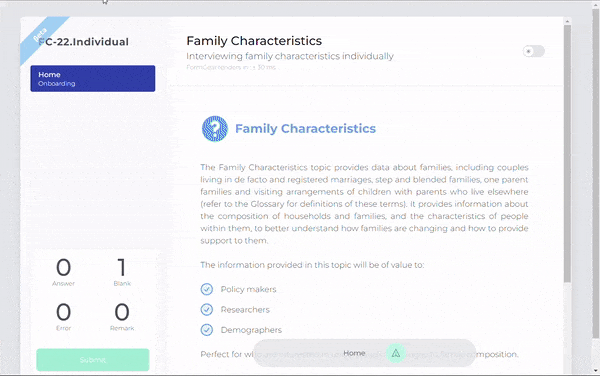

<p align="center"></p>
<p align="center" style="margin-top:-5%"></p>

<p align="center">
FormGear is a framework engine for dynamic form creation and complex form processing and validation for data collection. It is designed to work across multiple data collection platforms such as CAPI, CAWI, and PAPI.
</p>
<p>


# About


FormGear is a framework engine for form creation, processing, and validation.
FormGear was initially designed to support official statistics data collection in BPS - Statistics Indonesia, Indonesia's National Statistics Office, by a team under the direction of BPS. This requirement calls for dynamic form creation, complex processing and validation, and ease of use in the data collection process.

FormGear uses a defined JSON object template, thus is easy to build, use, and efficiently handle nested inquiries to capture everything down to the last detail. Unlike other similar framework, validation is handled in a FALSE condition in which each field is validated against a test equation. This leads to a more efficient and effective way of validating each component. 

<p align="center"></p>


# Features


- Easily create complex form with various form controls.
- Divide form into several sections for ease during data collection.
- Create nested form inquiry to accommodate recurring fields.
- Add conditions to enable form control.
- Validate answer given during data collection with your own test function.
- Add remark to record additional information.
- Add preset to provide information acquired prior to data collection.

# Usage

## Table of Content
- [About](#about)
- [Features](#features)
- [Usage](#usage)
    * [Online examples](#online-examples) 
    * [Develop on JS Framework examples](#develop-on-js-framework-examples) 
    * [Installation](#installation)
    * [Template](#template)
        + [Control Type](#control-type)
        + [Component Type](#component-type)
        + [Input for `ListSelectInputRepeat`, `MultipleSelectInput`, `RadioInput`, and `CheckboxInput`](#input-for-listselectinputrepeat-multipleselectinput-radioinput-and-checkboxinput)
        + [Input for `RangeSliderInput`](#input-for-rangesliderinput)
        + [Input for `sourceSelect`](#input-for-sourceselect)
    * [Preset](#preset)
    * [Response](#response)
    * [Validation](#validation)
    * [Remark](#remark)
- [Contributing](#contributing)
    * [Further development ideas](#further-development-ideas) 
- [License](#license)
- [Our Team](#our-team)


## Online examples
- [Fill a form](https://solid-form-gear.vercel.app/), or
- [Build one yourself](https://codesandbox.io/s/solid-form-gear-vvj0wt).

## Develop on JS Framework examples:
- [SolidJS](https://www.solidjs.com/)
    * Demo : https://solid-form-gear.vercel.app/
    * Code Example : https://codesandbox.io/s/solid-form-gear-vvj0wt
    * Repo : https://github.com/AdityaSetyadi/solid-form-gear
- [Angular](https://angular.io/)
    * Demo : https://angular-form-gear.vercel.app/
    * Code Example : https://codesandbox.io/s/angular-form-gear-diy9p0
    * Repo : https://github.com/AdityaSetyadi/angular-form-gear
- [Vue.js](https://vuejs.org/)
    * Demo : https://vue-form-gear.vercel.app/
    * Code Example : https://codesandbox.io/s/vue-form-gear-sfilvp
    * Repo : https://github.com/AdityaSetyadi/vue-form-gear
    

## Installation
FormGear can be installed via package manager like `npm` or `yarn`, or it can be used directly via CDN.

```bash
npm install form-gear
```

```jsx
import { FormGear } from 'form-gear'
import {  } from './node_modules/form-gear/dist/style.css'

const data = Promise.all([
                fetch("./data/template.json").then((res) => res.json()),
                fetch("./data/preset.json").then((res) => res.json()),
                fetch("./data/response.json").then((res) => res.json()),
                fetch("./data/validation.json").then((res) => res.json())
                fetch("./data/remark.json").then((res) => res.json())
            ]);

data.then(([template, preset, response, validation, remark]) => initForm(template, preset, response, validation, remark));

function initForm(template, preset, response, validation, remark){
        
   let config = {
      clientMode: 1, // CAWI = 1, CAPI = 2
      token: ``,
      baseUrl: ``,
      lookupKey: `key%5B%5D`,
      lookupValue: `value%5B%5D`,
      username: 'AdityaSetyadi',
      formMode: 1 // 1 => OPEN ; 2 => REJECTED ; 3 => SUBMITTED ; 4 => APPROVED ;
   }
   
   let uploadHandler = function (setter) {
      console.log('camera handler', setter);
      cameraFunction = setter;
      openCamera();
   }

   let GpsHandler = function (setter, isPhoto) {
      console.log('camera handler', setter);
      isPhoto = true,
         cameraGPSFunction = setter;
      openCameraGPS(isPhoto);
   }

   let onlineSearch = async (url) =>
      (await fetch(url, setBearer())
         .catch((error: any) => {
            return {
               success: false,
               data: {},
               message: '500'
            }
         }).then((res: any) => {
         if (res.status === 200) {
            let temp = res.json();
            return temp;
         } else {
            return {
               success: false,
               data: {},
               message: res.status
            }
         }
         }).then((res: any) => {
            return res;
         }
      ));

   let setResponseMobile = function (res, rem) {
      respons = res
      remarks = rem

      console.log('respons', respons)
      console.log('remarks', remarks)
   }

   let setSubmitMobile = function (res, rem) {
      respons = res
      remarks = rem

      console.log('respons submit', respons)
      console.log('remarks submit', remarks)
   }

   let openMap = function (koordinat) {
      koordinat = koordinat

      console.log('coordinat ', koordinat)
   }

   let form = FormGear(template, preset, response, validation, remark, config, uploadHandler, GpsHandler, onlineSearch, setResponseMobile, setSubmitMobile, openMap);
   
   return form;
   
}

```

## Template

FormGear use defined template which is based on JSON Object. This allows for dynamic form creation, letting you to easily build your form with various form controls simply by expanding the JSON object. This also allows FormGear to create nest other form control in other form control, making it easy for you to create recurring questions based on the nested form control. Below is the structure and example of the JSON object that FormGear uses as its form template.

```
template.json
│   description
│   dataKey
│   title
│   acronym
│   ...
└───components
│   │   section
│   └───components
│       │   textInput
│       │   checkboxInput
│       │   selectInput
│       │   ...
└───
│   │   section
│   └───components
│       │   textInput
│       │   checkboxInput
│       │   nestedInput
│       └───
│           │   sourceQuestion
│           └───components
│               │   textInput
│               │   checkboxInput
│               │   nestedInput
│               └───
│                   │   sourceQuestion
│                   └───components
│                       │   textInput
│                       │   dateInput
│                       │   ...
│               │   ...
│       │
│       │   dateInput
│       │   ...
└───
│   │   section
│   └───components
│       │   textInput
│       │   checkboxInput
│       │   selectInput
│       │   ...
│

```

```json
[
    {
        "label":"Hobbies",
        "dataKey":"hobbies",
        "type":29,
        "cols":3,
        "options":[
            {
                "label":"Sleeping",
                "value":"1"
            },
            {
                "label":"Play Games",
                "value":"2"
            },
            {
                "label":"Watching Movie",
                "value":"3"
            },
            {
                "label":"Cooking",
                "value":"4"
            },
            {
                "label":"Working",
                "value":"5"
            },
            {
                "label":"Travelling",
                "value":"6"
            },
            {
                "label":"Other",
                "value":"13",
                "open":true
            }
        ]
    },
    {
        "label": "Province",
        "dataKey": "l2_r322_prov_1",
        "typeOption" : 2,
        "type": 27,
        "enableCondition":"Number(getValue('l2_land_location@$ROW$')) > 0",
        "componentEnable":["l2_land_location@$ROW$"],
        "sourceSelect":[{
            "id": "f796a32a-36df-4554-bb79-bf8065e28c52",
            "tableName": "kode_kab_ppkk",
            "value": "kode_prov",
            "desc": "nama_prov",
            "parentCondition": [
            
            ]  
        }]
    },
    {
        "label":"Healthy neighborhood rating",
        "dataKey":"rating",
        "type":26,
        "cols":5,
        "options":[
            {
                "label":"",
                "value":"1"
            },
            {
                "label":"",
                "value":"2"
            },
            {
                "label":"",
                "value":"3"
            },
            {
                "label":"",
                "value":"4"
            },
            {
                "label":"",
                "value":"5"
            }
        ]
    },
    {
        "label":"Happiness Index",
        "dataKey":"happy",
        "type":18,
        "range":[
        {
            "min":0,
            "max":100,
            "step":5
        }
        ]
    },
    {
        "label":"Chld nested",
        "dataKey":"childnested",
        "description":"ChildNested",
        "type":2,
        "sourceQuestion":"hobbies",
        "components":[
            [
                {
                    "label":"name--- $NAME$",
                    "dataKey":"name_",
                    "type":4,
                    "expression":"let nm = ''; let list = getValue('hobbies'); if(list !== undefined && list.length > 0) { let rowIndex = getRowIndex(0); let filter = list.filter(obj => obj.value == rowIndex); nm=filter[0].label }; nm;",
                    "componentVar":["hobbies"],
                    "render":true,
                    "renderType":1
                }
            ]
        ]
    }
]
```

### Control Type

---

FormGear allows you to work with a lot of possible HTML input types. To add a control type, you can simply add the code as a value of the `type` component as a JSON object and add other corresponding components:

```json
{
   "description":"Interviewing family characteristics individually",
   "dataKey":"family-characteristics-2022",
   "title":"Family Characteristics",
   "acronym":"FC-22.Individu",
   "version":"0.0.1",
   "components":[
		    {
                        "label":"Full Name",
                        "dataKey":"full_name",
                        "hint":"Full name including his degree, position, etc",
                        "answer":"Ignatius",
                        "enableRemark":true,
                        "type":25
                    }
		]
}

```

FormGear uses numbers as code to define each control type. Below is a table of control types and their corresponding code and description.

| Control Type | Code | Description |
| --- | --- | --- |
| `Section` | 1 | Adds section to form. |
| `NestedInput` | 2 | Adds nested input field to existing field. |
| `InnerHTML` | 3 | Adds text written in HTML format. |
| `VariableInput` | 4 | Variable input. |
| `DateInput` | 11 | Date input. |
| `DateTimeLocalInput` | 12 | Date and time input field with no time zone. |
| `TimeInput` | 13 | Time input field. |
| `MonthInput` | 14 | Month input field. |
| `WeekInput` | 15 | Week input field. |
| `SingleCheckInput` | 16 | Checkbox input field, lets user choose only one option out of limited choices. |
| `ToggleInput` | 17 | Toggle input. |
| `RangeSliderInput` | 18 | Range slider input, lets user to select a value or range of value from a specified min and max. |
| `UrlInput` | 19 | URL input field. |
| `CurrencyInput` | 20 | Currency input field, limited to IDR and USD. |
| `ListTextInputRepeat` | 21 | Text input field, creating a list by letting user add more written input as needed. |
| `ListSelectInputRepeat` | 22 | Dropdown input field, creating a list by letting user add more choices as needed. |
| `MultipleSelectInput` | 23 | Drop-down input, lets user to choose one or more options of limited choices. |
| `MaskingInput` | 24 | Number input with certain formatting, such as phone number and taxpayer identification number. |
| `TextInput` | 25 | Single-line input field. |
| `RadioInput` | 26 | Radio button, lets user choose one options of limited choices. |
| `SelectInput` | 27 | Drop-down input. |
| `NumberInput`| 28 | Numeric input field. |
| `CheckboxInput` | 29 | Checkbox input field, lets user choose one or more options of limited choices. |
| `TextAreaInput` | 30 | Adjustable text area input field. |
| `EmailInput` | 31 | Email address input field. |
| `PhotoInput` | 32 | Photo input, lets user add picture with .`jpg`, `.jpeg`, `.png`, and `.gif` format. |
| `GpsInput` | 33 | GPS input. |
| `CsvInput` | 34 | CSV input, lets user upload `.csv` file to be stored as `.json` format in the Response. The `.csv` file can later be downloaded again in the same format. |

### Component Type

---

To customize each form control further, you can use components . Below are the components, the corresponding `ControlType` in which the component can be used, the input or value type of each component, and the description.

| Component Type | Corresponding `ControlType`  | Input Type | Description | Notes |
| --- | --- | --- | --- | --- |
| `dataKey` | All | `string` | Component identifier. |  |
| `label` | All | `string` | Component label that will show up in the form. |  |
| `hint` | All | `string` | Provide hint on how to fill the corresponding field. |  |
| `type` | All | `ControlType` | any | Define the ControlType of a field. |  |
| `components` | 1, 2 | `ComponentType` | Store components inside a Section or NestedInput. |  |
| `rows` | 30 | `number` | Define the number of rows needed in TextAreaInput. |  |
| `cols` | 26, 29 | `number` | Define the number of columns the options in RadioInput and CheckboxInput will be divided to. |  |
| `options` | 22, 23, 26, 29 | `Option[]` | Define options for ListSelectInputRepeat, MultipleSelectInput, RadioInput, and CheckboxInput.  |  |
| `range` | 18 | `Range[]` | Define the min, max, and value of each step for a RangeSliderInput. |  |
| `description` | 1, 2 | `string` | Adds description for a `Section` or `NestedInput`. |  |
| `answer` | All | any | Storing answer collected on data collection. | `ListSelectInputRepeat`  and `MultipleSelectInput` must add: `[{"label": "lastId#0","value": "0"}]` |
| `sourceQuestion` | 2 | `string` | Define the source question for a `NestedInput` field. |  |
| `sourceOption` | 22, 23, 26, 27, 29 | `string` | Source of the options used in the field. |  |
| `typeOption` | 22, 23, 26, 27, 29 | `number` | Type of the options used in the field. | 1: Its component, 2: A lookup table, 3: Other component. |
| `currency` | 20 | `string` | Define the currency that will be used in a `CurrencyInput` field, limited to IDR and USD. |  |
| `separatorFormat` | 20 | string | Define the separator that will be used in a CurrencyInput field. |  |
| `isDecimal` | 20 | `boolean` | Define whether or not a `CurrencyInput` field allows decimal. |  |
| `maskingFormat` | 24 | `string` | Define the format of `maskingInput` used. | 9 for numbers, a for letters, and * for alphanumeric format. e.g. : `'maskingFormat' : '9999-aa99'`  |
| `expression` | 4 | `string` | A variable expression. | `getValue` function can be used to get the value of other field. |
| `componentVar` | 4 | `string[]` | Define the component(s) used in `VariableInput`. |  |
| `render` | 4 | `boolean` | Define whether or not the variable will be rendered. |  |
| `renderType` | 4 | `number` | Variable output type. | 1: single output, 2: array output |
| `enable` | All | `boolean` | Define whether or not a component have a condition(s) that need to be fulfilled before it can be filled. |  |
| `enableCondition` | All | `string` | An expression to define a condition enabled for the field to be filled. | `getProp` function can be used to get the client mode, `getValue` function can be used to get the value of other field. |
| `componentEnable` | All | `string[]` | A list of component(s) used in a condition expression. |  |
| `enableRemark` | All | `boolean` | Define whether or not a component allows a remark. |  |
| `titleModalDelete` | 21, 22 | `string` | Title of the warning that will show up when user tries to delete an item in `ListTextInputRepeat` or `ListSelectInputRepeat`. |  |
| `contentModalDelete` | 21, 22 | `string` | Content of the warning that will show up when user tries to delete an item in `ListTextInputRepeat` or `ListSelectInputRepeat`. |  |

### Input for `ListSelectInputRepeat`, `MultipleSelectInput`, `RadioInput`, and `CheckboxInput`

---

`Option[]` defines option components for `ListSelectInputRepeat`, `MultipleSelectInput`, `RadioInput`, and `CheckboxInput` input.

- `label`: label of an option that will show up in the form.
- `value`: value of an option that will be recorded.
- `open`: define whether or not an option is open-ended. The value recorded will be both the `value` of an option and the `label` entered on data collection.

```json
[
    {
        "label":"Hobbies",
        "dataKey":"hobbies",
        "type":29,
        "cols":3,
        "options":[
            {
                "label":"Sleeping",
                "value":"1"
            },
            {
                "label":"Play Games",
                "value":"2"
            },
            {
                "label":"Watching Movie",
                "value":"3"
            },
            {
                "label":"Cooking",
                "value":"4"
            },
            {
                "label":"Working",
                "value":"5"
            },
            {
                "label":"Travelling",
                "value":"6"
            },
            {
                "label":"Other",
                "value":"13",
                "open":true
            }
        ]
    }
]
```

### Input for `RangeSliderInput`

---

`Range[]` defines components of `RangeSliderInput` input.  

- `min`: minimum of a range.
- `max`: maximum of a range.
- `step`: added value for each step.

```json
[
   {
       "label":"Happiness Index",
       "dataKey":"happy",
       "type":18,
       "range":[
            {
                "min":0,
                "max":100,
                "step":5
            }
        ]
    }
]
```

### Input for `sourceSelect`

---

`sourceOption` defines components of `sourceSelect` input.

- `id`: unique identifier of the lookup table that will be used.
- `tableName`: the name of the lookup table that will be used.
- `value`: the column name in the lookup table that will be recorded as the option’s value.
- `desc`: the column name in the lookup table that will be shown as the option’s label.
- `parentCondition`: an array consisting of `key` and `value`. `key` refers to the parent lookup table’s `value`, while `value` refers to the parent lookup table’s `desc`.

```json
[
    {
        "label":"Child nested",
        "dataKey":"childnested",
        "description":"ChildNested",
        "type":2,
        "sourceQuestion":"hobbies",
        "components":[
            [
                {
                    "label":"name--- $NAME$",
                    "dataKey":"name_",
                    "type":4,
                    "expression":"let nm = ''; let list = getValue('hobbies'); if(list !== undefined && list.length > 0) { let rowIndex = getRowIndex(0); let filter = list.filter(obj => obj.value == rowIndex); nm=filter[0].label }; nm;",
                    "componentVar":["most_fav"],
                    "render":true,
                    "renderType":1
                }
            ]
        ]
    }
]
```

## Preset
Preset is used to provide prefilled data given prior to data collection.  This prefilled data usually obtained from previous data collection or a listing conducted before the actual data collection. Preset consists of `dataKey` of the corresponding field and the prefilled `answer` to that field.

```
preset.json
│
└───predata
│   │
│   └───
│       │   dataKey
│       │   answer
│   │
│   └───
│       │   dataKey
│       │   answer
│
```

```json
{
   "description":"sample template",
   "dataKey":"sample_tpl1",
   "predata":[
      {
         "dataKey":"nama_lengkap",
         "answer":"Setyadi"
      }
   ]
}
```

## Response
Response is initially empty, and is used to store any response given later during data collection. Response consists of `dataKey` of the corresponding field and the `answer` collected from that field. `answer` from a field that has both `label` and `value` will record both. `answer` will only be collected if the value entered to the corresponding field satisfied both the condition enabled and validation test function. Below is the structure and example of the response JSON object:

```
response.json
│
│   description
│   dataKey
│   templateVersion
│   validationVersion
│   createdBy
│   updatedBy
│   createdAt
│   updatedAt
└───answers
│   	   │
│   	   └───
│       	│   dataKey
│       	│   answer	
│   	   │
│   	   └───
│       	│   dataKey
│       	│   answer
│

```

```json
{
   "description":"sample template",
   "dataKey":"sample_tpl1",
   "answers":[
      {
         "dataKey":"agree",
         "answer":true
      },
      {
         "dataKey":"full_name",
         "answer":"Agung"
      },
      {
         "dataKey":"members",
         "answer": {
            "value" : "3",
            "label" : "Clementine Bauch"
         }
      },
      {
         "dataKey":"address",
         "answer":"Jalan Otista"
      },
      {
         "dataKey":"field_usage",
         "answer":[
            {
               "label": "lastId#1",
               "value": "0"
            },
            {
               "label": "Farm",
               "value": "1"
            },
            {
               "label": "Meadows",
               "value": "3"
            }
         ]
      },
   ]
}

```

## Validation
Validation is used to validate the answer given during data collection against a test function. Unlike other similar framework, validation is handled in a FALSE condition, meaning the test function is a condition where the value entered to a form control would be false. Validation has several components you can add:

- `dataKey`: component identifier.
- `validations`: store validation for each `dataKey`.
- `componentValidation`: a list of the `dataKey` of components used in the test function.
- `test`: the test function. A `getValue` function can be used to get the value of other field.
- `message`: the warning message that will show up when the value entered did not fulfill the test function.
- `type`: define whether the validation will be just a warning or an error.

Below are the structure and example of the validation JSON object:

```
validation.json
│
└───description
│   dataKey
│   version
│   testFunctions
│   │
│   └───
│       │   dataKey
│       │   componentValidation
│       │   validations
│			│
│			└───
│			    │   test
│			    │   message
│			    │   type	
│			│
│			└───
│			    │   test
│			    │   message
│			    │   type
│
```

```json
{
    "description":"sample template",
    "dataKey":"sample_tpl1",
    "version":"0.0.1",
    "testFunctions":[
        {
            "dataKey":"age",
            "componentValidation":["age"],
            "validations": [
                {
                    "test":"getValue('age') >= 8 && getValue('age') < 10",
                    "message":"Min.10 y.o.",
                    "type":1
                },
                {
                    "test":"getValue('age') < 8",
                    "message":"Min.8 y.o.",
                    "type":2
                }
            ]
        }
    ]
}
```

## Remark
Remark is initially empty and used to store notes on each field collected later during data collection. This note can be used to provide additional information of a field and bypass validation if the data found during data collection doesn’t satisfy the test function. Below is the structure and example of the remark JSON object:

```
remark.json
│
└───dataKey
|   notes
│   │
│   └───
│       │   dataKey
│       │   comments
│		    │
│		    └───
│		        │   sender
│		        │   dateTime
│		        │   comment	
│		    │
│		    └───
│		        │   sender
│		        │   dateTime
│		        │   comment
│
```

```json
{
    "dataKey": "",
    "notes": [
        {
            "dataKey": "full_name",
            "comments": [
                {
                    "sender": "AdityaSetyadi",
                    "datetime": "2022-03-17 15:09:54",
                    "comment": "Based on the ID Card"
                },
                {
                    "sender": "AdityaSetyadi",
                    "datetime": "2022-03-18 10:10:40",
                    "comment": "Not the same with his driving license"
                }
            ]
        },
        {
            "dataKey": "land_area#1",
            "comments": [
                {
                    "sender": "AdityaSetyadi",
                    "datetime": "2022-03-18 01:09:15",
                    "comment": "Unknown"
                }
            ]
        }
    ]
}
```

# Contributing

Your assistance is greatly appreciated if you want to contribute and make it better.
### Further development ideas:
- FormGear templates design platform
- FormGear validation creator platform

# License

FormGear is licensed under [MIT License](https://github.com/AdityaSetyadi/form-gear/blob/main/LICENSE).


# Our Team

- [Ignatius Aditya Setyadi](https://github.com/AdityaSetyadi)
- [Ardian Saputra Hasibuan](https://github.com/ardian28)
- [D. Agung Sungkono](https://github.com/das-agung)
